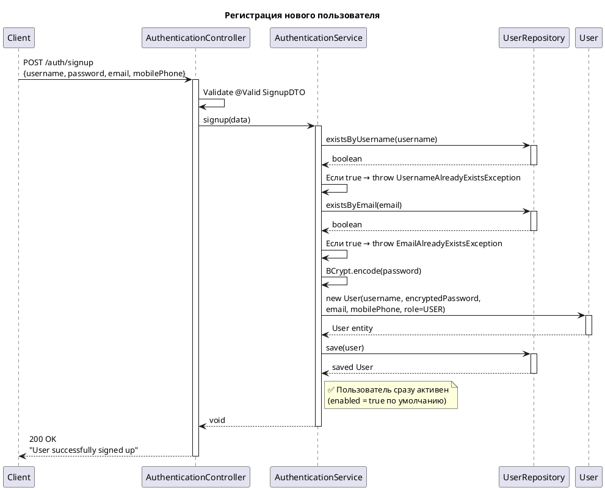
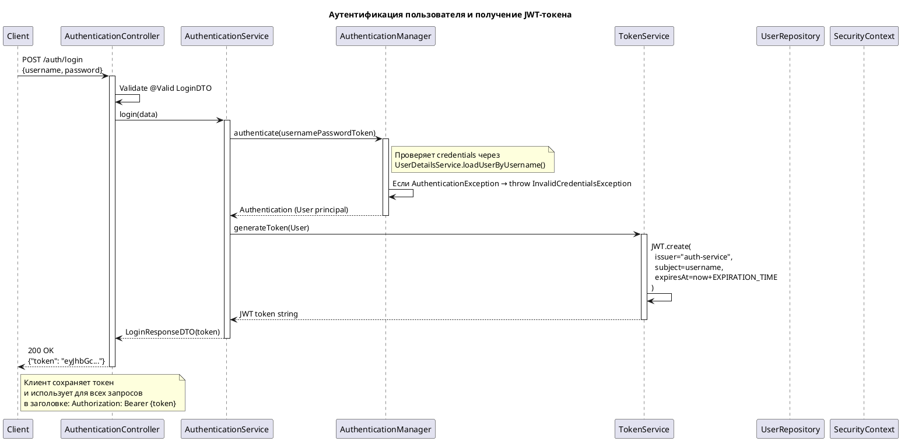
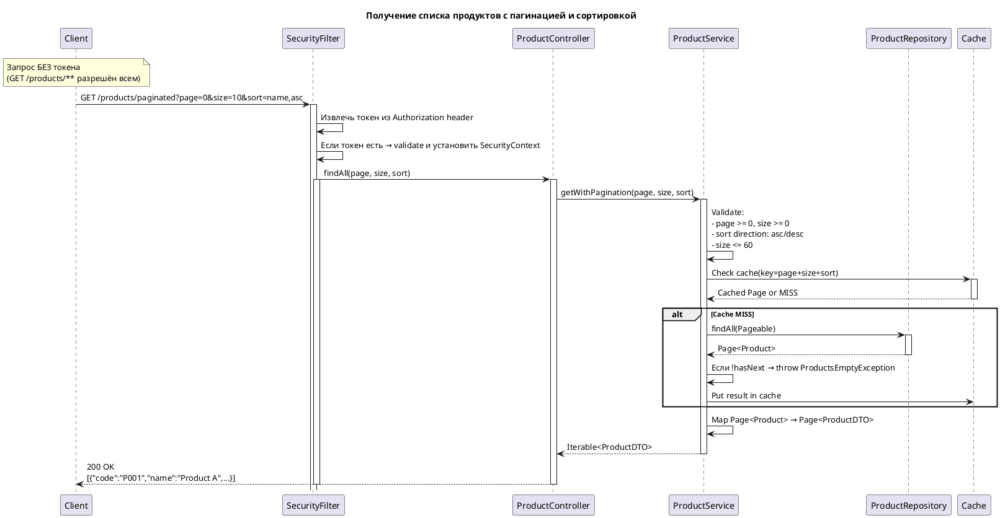
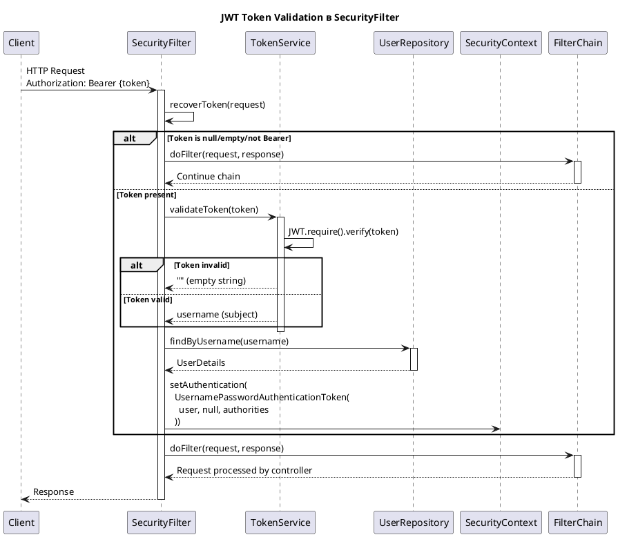

# Sequence Diagrams — Product Manager Service

## Обзор архитектуры

```
┌─────────────────────────────────────────────────────────────────┐
│                         Client                                  │
│                    (Browser / Mobile / API)                     │
└─────────────────────────────────────────────────────────────────┘
                              │
                              ▼
┌─────────────────────────────────────────────────────────────────┐
│                    SecurityFilterChain                          │
│  ┌─────────────────┐  ┌─────────────────┐  ┌─────────────────┐  │
│  │ SecurityFilter  │→ │  Authentication │  │  Authorization  │  │
│  │  (JWT Token)    │  │    Manager      │  │    Service      │  │
│  └─────────────────┘  └─────────────────┘  └─────────────────┘  │
└─────────────────────────────────────────────────────────────────┘
                              │
                              ▼
┌─────────────────────────────────────────────────────────────────┐
│                      Controllers Layer                          │
│  ┌─────────────────────────┐  ┌─────────────────────────────┐   │
│  │ AuthenticationController│  │    ProductController        │   │
│  │  /auth/**               │  │     /products/**            │   │
│  └─────────────────────────┘  └─────────────────────────────┘   │
└─────────────────────────────────────────────────────────────────┘
                              │
                              ▼
┌─────────────────────────────────────────────────────────────────┐
│                       Services Layer                            │
│  ┌─────────────────────────┐  ┌─────────────────────────────┐   │
│  │ AuthenticationService   │  │    ProductService           │   │
│  │ AuthorizationService    │  │  (Cache + Validation)       │   │
│  │ TokenService            │  │                             │   │
│  └─────────────────────────┘  └─────────────────────────────┘   │
└─────────────────────────────────────────────────────────────────┘
                              │
                              ▼
┌─────────────────────────────────────────────────────────────────┐
│                      Repositories Layer                         │
│  ┌─────────────────────────┐  ┌─────────────────────────────┐   │
│  │   UserRepository        │  │    ProductRepository        │   │
│  │  (Spring Data JPA)      │  │   (Spring Data JPA)         │   │
│  └─────────────────────────┘  └─────────────────────────────┘   │
└─────────────────────────────────────────────────────────────────┘
                              │
                              ▼
┌─────────────────────────────────────────────────────────────────┐
│                         Database                                │
│                    (PostgreSQL via Flyway)                      │
└─────────────────────────────────────────────────────────────────┘
```

---

## Сценарий 1: Регистрация пользователя (Signup)



**HTTP Request:**

```http
POST /auth/signup
Content-Type: application/json

{
  "username": "john_doe",
  "password": "SecurePass123!",
  "email": "john@example.com",
  "mobilePhone": "01234567890"
}
```

**Response:**

```http
HTTP/1.1 200 OK
Content-Type: text/plain

User successfully signed up
```

---

## Сценарий 2: Аутентификация (Login)



**HTTP Request:**

```http
POST /auth/login
Content-Type: application/json

{
  "username": "john_doe",
  "password": "SecurePass123!"
}
```

**Response:**

```http
HTTP/1.1 200 OK
Content-Type: application/json

{
  "token": "eyJhbGciOiJIUzI1NiIsInR5cCI6IkpXVCJ9..."
}
```

---

## Сценарий 3: Получение продуктов с пагинацией



**HTTP Request:**

```http
GET /products/paginated?page=0&size=10&sort=name,asc
```

**Response:**

```http
HTTP/1.1 200 OK
Content-Type: application/json

[
  {
    "code": "P001",
    "name": "Product Alpha",
    "price": 99.99,
    "description": "Description here"
  },
  ...
]
```

---

## Сценарий 4: Создание продукта (Требует ADMIN)

**HTTP Request:**

```http
POST /products/create
Authorization: Bearer eyJhbGc...
Content-Type: application/json

{
  "code": "P002",
  "name": "Product Beta",
  "price": 149.99,
  "description": "New product description"
}
```

**Response:**

```http
HTTP/1.1 200 OK
Content-Type: text/plain

Product successfully created
```

---

## Сценарий 5: Получение продукта по ID

**HTTP Request:**

```http
GET /products/find?product=123
```

**Response:**

```http
HTTP/1.1 200 OK
Content-Type: application/json

{
  "code": "P001",
  "name": "Product Alpha",
  "price": 99.99,
  "description": "Description"
}
```

---

## Сценарий 6: Обновление продукта (ADMIN only)

**HTTP Request:**

```http
PUT /products/update?product=123
Authorization: Bearer eyJhbGc...
Content-Type: application/json

{
  "code": "P002-UPD",
  "name": "Product Beta Updated",
  "price": 199.99,
  "description": "Updated description"
}
```

**Response:**

```http
HTTP/1.1 200 OK
Content-Type: text/plain

Product successfully updated
```

---

## Сценарий 7: Удаление продукта (ADMIN only)

**HTTP Request:**

```http
DELETE /products/delete?product=123
Authorization: Bearer eyJhbGc...
```

**Response:**

```http
HTTP/1.1 200 OK
Content-Type: text/plain

Product successfully deleted
```

---

## Сценарий 8: JWT Token Validation Flow (SecurityFilter)



---

## Таблица endpoint'ов

| Метод  | Endpoint              | Auth | Role  | Описание                        |
|--------|-----------------------|------|-------|---------------------------------|
| POST   | `/auth/signup`        | ❌    | -     | Регистрация нового пользователя |
| POST   | `/auth/login`         | ❌    | -     | Аутентификация, получение JWT   |
| GET    | `/products/paginated` | ❌    | -     | Получение списка продуктов      |
| GET    | `/products/find`      | ❌    | -     | Получение продукта по ID        |
| POST   | `/products/create`    | ✅    | ADMIN | Создание продукта               |
| PUT    | `/products/update`    | ✅    | ADMIN | Обновление продукта             |
| DELETE | `/products/delete`    | ✅    | ADMIN | Удаление продукта               |
| GET    | `/swagger-ui/**`      | ❌    | -     | Swagger UI                      |
| GET    | `/v3/api-docs/**`     | ❌    | -     | OpenAPI spec                    |

---

## Кэш

**Cache Provider:** Spring Cache (по умолчанию ConcurrentMapCache)

| Cache Name | Key                                        | Evict Trigger                               |
|------------|--------------------------------------------|---------------------------------------------|
| `products` | `page.toString() + size.toString() + sort` | createProduct, updateProduct, deleteProduct |
| `products` | `productId`                                | createProduct, updateProduct, deleteProduct |

---

## Исключения

### Auth Exceptions

| Exception                        | HTTP Status | Condition              |
|----------------------------------|-------------|------------------------|
| `UsernameAlreadyExistsException` | 400         | Username занят         |
| `EmailAlreadyExistsException`    | 400         | Email занят            |
| `InvalidCredentialsException`    | 401         | Неверный логин/пароль  |
| `UserNotFoundException`          | 404         | Пользователь не найден |

### Product Exceptions

| Exception                               | HTTP Status | Condition                  |
|-----------------------------------------|-------------|----------------------------|
| `ProductNotFoundException`              | 404         | Продукт не найден          |
| `ProductsEmptyException`                | 404         | Страница пуста             |
| `ModelValidationException`              | 400         | Code/Name уже существует   |
| `InvalidArgumentsToPaginationException` | 400         | page < 0 или size < 0      |
| `InvalidSortDirectionException`         | 400         | sort direction не asc/desc |

---

## Примечания

### ✅ Упрощения (OTP и Mail удалены)

Следующие endpoint'ы **удалены** как избыточные:

- ~~`POST /auth/verify-account`~~ — подтверждение аккаунта через OTP
- ~~`POST /auth/resend-verification`~~ — повторная отправка OTP
- ~~`POST /password/request-reset`~~ — запрос сброса пароля
- ~~`POST /password/reset`~~ — сброс пароля

**Пользователь активен сразу после регистрации** — поле `enabled` всегда `true`.

### 🔐 Безопасность

- JWT токены используются для stateless аутентификации
- Время жизни токена настраивается в `application.properties`: `auth.security.token.expiration-time`
- Пароли хранятся в encrypted виде (BCrypt)
- Только ADMIN может создавать/обновлять/удалять продукты
- GET запросы к продуктам доступны без аутентификации

### 📦 Удалённые классы

**Mail-функционал:**

- `EmailUtil`
- `EmailConfigurations`
- `PasswordResetController`
- `PasswordResetService`
- `IPasswordResetService`

**OTP-функционал:**

- `OneTimePassword`
- `OtpUtil`
- `SignupResponseDTO`

**Исключения:**

- `UserAlreadyVerifiedException`
- `UserNotEnabledException`
- `InvalidOtpException`
- `MissingArgumentsToResetPasswordException`
- `PasswordsDoNotMatchException`
- `ResetPasswordExceptionsHandler`
